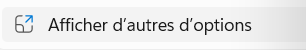

# Menu_Contextuel_W10_W11_Automatisation
Scripts .bat pour restaurer l'ancien menu contextuel (clic droit) de Windows 10 sous Windows 11 dans l'explorateur, ainsi que le script pour revenir au menu contextuel moderne.

<h1>Restaurer l’ancien menu contextuel (clic droit) sous Windows 11</h1>

Ce dépôt fournit deux scripts <strong>.bat</strong> pour :

<ul>
<li>✅ <strong>Activer</strong> le menu contextuel “classique” (style Windows 10) directement au clic droit</li>
<li>🔁 <strong>Revenir</strong> au menu contextuel moderne Windows 11</li>
</ul>

<blockquote>

<strong>Effet attendu :</strong> ne plus devoir cliquer sur “Afficher plus d’options”.

</blockquote>

<h2>📦 Contenu du dépôt</h2>

<pre><code>.
├─ scripts/
│ ├─ Menu_Contextuel_Classique_de_W10_pour_W11.bat
│ └─ Menu_Contextuel_W11_Moderne.bat
├─ images/
│ ├─ avant_menu_w11.png
│ ├─ apres_menu_classique.png
│ └─ afficher_plus_options.png
└─ README.md
</code></pre>

<h2>🧠 Comment ça fonctionne</h2>

Windows 11 utilise un mécanisme différent pour construire le menu contextuel moderne.

Le script ajoute une clé de registre <strong>par utilisateur</strong> (dans <code>HKCU</code> = <em>HKEY_CURRENT_USER</em>) :

<ul>
<li><code>HKCU\Software\Classes\CLSID\{86ca1aa0-34aa-4e8b-a509-50c905bae2a2}\InprocServer32</code></li>
<li>et définit la <strong>valeur (par défaut)</strong> vide</li>
</ul>

Ce “tweak” force l’Explorateur à <strong>retomber sur le menu contextuel classique</strong>.

Pour appliquer sans redémarrer le PC, le script redémarre l’Explorateur :

<ul>
<li>ferme <code>explorer.exe</code></li>
<li>relance <code>explorer.exe</code></li>
</ul>

# 🖼️ Aperçu visuel

### Avant (menu Windows 11)

### Après (menu classique)

### Bouton "Afficher plus d’options"

